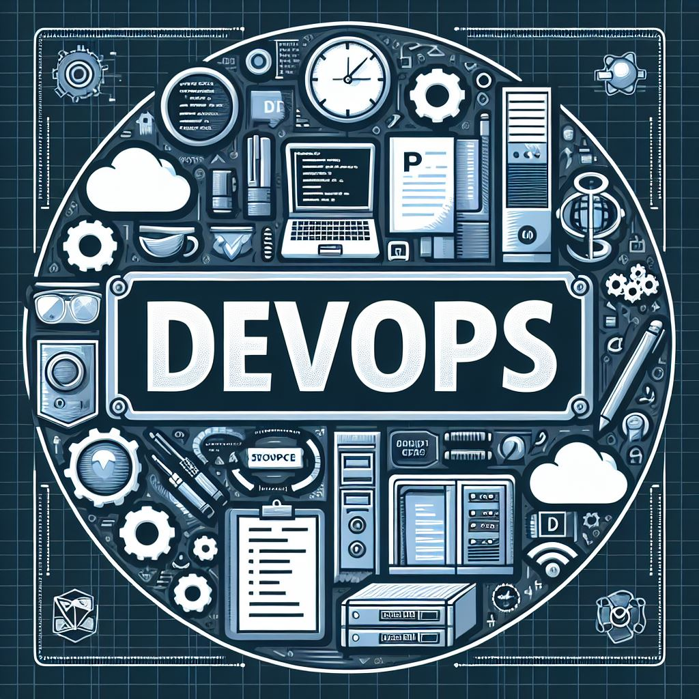

# DevOps12 Professional Course Repository

## Introduction
Welcome to my DevOps12 Professional Course Repository.

📌 This repository contains homework, projects, and exercises completed during the DevOps12 Professional Course.

## 📁 Folder Structure
   - assets/ - Images and resources used in documentation.
   - bash/   - bash scripts and automations tasks.
     
## 🚀 About Me
My name is not important. What is important is My name.

## Author
[@mendelsontal]()

  

